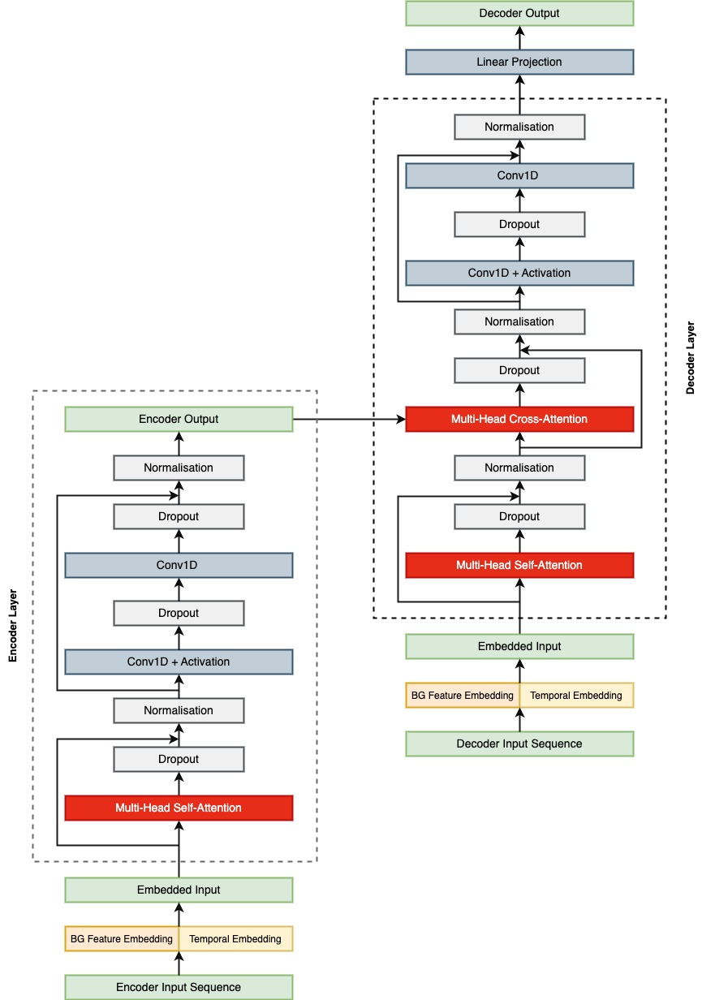
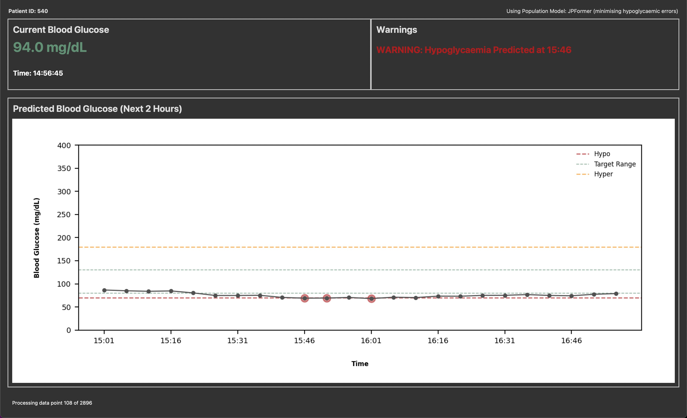

# **Informer Based Blood Glucose Prediction**

This repository contains the implementation of JPFormer and other Informer-based models for blood glucose prediction in Type 1 Diabetes Patients.

## **1. About**

This project investigated Informer-based blood glucose prediction models with a specific focus on:

* Development of JPFormer, a novel model employing windowed self-attention.
* Comparative analysis of attention mechanisms in Informer-based models (JPFormer, Informer, GPFormer and BGFormer).
* The influence of personalised model fine-tuning on prediction performance.
* Evaluation of models performance across extended prediction horizons up to 120 minutes.

The repository includes:

* Requirements for running all files within the repository
* Data processing notebooks for the OHIOT1DM and REPLACE-BG datasets
* Development files for the JPFormer population and personalised models
* Final JPFormer models alongside implementations of Informer, GPFormer and BGFormer models
* Model Evaluation notebooks for
  * Evaluating the influence of attention mechanisms between models
  * Evaluating the role of personalised model fine-tuning
* Implementaton of an inference framework  which permits the use of trained models for blood glucose prediction with visualisation within a desktop application.

More details regarding each of these aspects can be found under the following sections.

## **2. Requirements**

To run the files within this repository it is necessary to download the repository to a local directory.

Following this the requirements should be installed within a new virtual environment by navigating to the directory root in your CLI.

If using conda run the following commands to create a new environment and install the requirements:

```bash
conda create -n jpformer python=3.12.8
conda activate jpformer
pip install -r requirements.txt
```

If pip is not installed within your conda environment, run the following command to install pip:

```bash
conda install pip
```

Or, if using venv run the following commands to create a new environment and install the requirements:

```bash
python -m venv jpformer
source jpformer/bin/activate
pip install -r requirements.txt
```
  
If using linux TKinter may not be installed by default and should be installed using your package manager.


## **3. Data**

The REPLACE-BG and OHIOT1DM datasets have been used within this project.

The REPLACE-BG dataset was used for development of the population JPFormer model.

The OHIOT1DM dataset was used for development of the personalised JPFormer model and for evaluation of final models.

Only the processed OHIOT1DM data is included within this repository to enable demonstration of the inference framework and replication of the final model evaluation.

The source data has not been included within this repository due to the size of files and restrictions on sharing the data. However, the data can be obtained from the following links.

The REPLACE-BG dataset is available from:
https://public.jaeb.org/dataset/546

The OHIOT1DM dataset is available by following the instructions at:
https://webpages.charlotte.edu/rbunescu/ohiot1dm.html

Once data is obtained, create a new subfolder within the following structure to enable compatabilty with the data processing files which can then be used to create the processed data files needed to replicate model development.

```bash
└── SourceData
    ├── Ohio
    │   ├── Test
    │   │   ├── 540-ws-testing.xml
    │   │   ├── 544-ws-testing.xml
    │   │   ├── 552-ws-testing.xml
    │   │   ├── 559-ws-testing.xml
    │   │   ├── 563-ws-testing.xml
    │   │   ├── 567-ws-testing.xml
    │   │   ├── 570-ws-testing.xml
    │   │   ├── 575-ws-testing.xml
    │   │   ├── 584-ws-testing.xml
    │   │   ├── 588-ws-testing.xml
    │   │   ├── 591-ws-testing.xml
    │   │   └── 596-ws-testing.xml
    │   └── Train
    │       ├── 540-ws-training.xml
    │       ├── 544-ws-training.xml
    │       ├── 552-ws-training.xml
    │       ├── 559-ws-training.xml
    │       ├── 563-ws-training.xml
    │       ├── 567-ws-training.xml
    │       ├── 570-ws-training.xml
    │       ├── 575-ws-training.xml
    │       ├── 584-ws-training.xml
    │       ├── 588-ws-training.xml
    │       ├── 591-ws-training.xml
    │       └── 596-ws-training.xml
    └── ReplaceBG
        ├── Data_tables
        │   └── hdevicecgm.txt
        └── readme.rtf
```

## **4. Models**

All models employ the following Informer-based architecture:



The attention mechanisms used within each model are as follows:

| Model    | Encoder Self Attention | Decoder Self Attention | Cross Attention |
| -------- | ---------------------- | ---------------------- | --------------- |
| JPFormer | Microscale             | Microscale             | Full            |
| Informer | ProbSparse             | ProbSparse             | Full            |
| GPFormer | Sparse                 | Sparse                 | Sparse          |
| BGFormer | Microscale             | Dual Attention         | Dual Attention  |

### **4.1 JPFormer Model & Development**

#### **4.1.1 Population Model**

The initial parameters for the general / population-level JPFormer model followed [Zhu et al. (2024)](https://discovery.ucl.ac.uk/id/eprint/10197097/2/Li_Multi-Horizon%20Glucose%20Prediction%20Across%20Populations%20with%20Deep%20Domain%20Generalization_AAM.pdf).

The influence of the following aspects were then evaluated leading to the final population JPFormer model:

* Feature Enhancement
* Model Dimensions
* Encoder Layers
* Dropout
* Training Epochs

The final JPFormer model is located at [models/jpformer/jpformer.py](https://github.com/JosephPassant/Informer-based-Blood-Glucose-Prediction/blob/main/models/jpformer/jpformer.py).

The final model weights can be found [here](models/jpformer/population_jpformer_final_model/population_jpformer_replace_bg_aggregate_results/jpformer_dual_weighted_rmse_loss_func_high_dim_4_enc_lyrs_high_dropout_0.5696_MAE_0.3965.pth).

#### **4.1.2 Personalised Models**

Personlised fine-tuning of the JPFormer model was performed for 10 epochs.
The inflence of the following aspects were evaluated leading to the final fine-tuning framwork and personalised models:

* Learning Rate
* Batch Size
* Dropout
  
Personalised modes for the 12 patients within the OHIOT1DM can be found at:
models/jpformer/fine_tuning_development_files/loss_function_weights_lowest/patient_540

replace '540' with the patient id of interest.

The available ID numbers are:
[540, 544, 552, 559, 563, 567, 570, 575, 584, 588, 591, 596]

### **4.3 Informer**

Informer is described in [Zhou et al., (2021)](https://arxiv.org/abs/2012.07436).

Impelmentation followed that detailed in the following repository:
https://github.com/zhouhaoyi/Informer2020

The informer model used is located at [models/informer/Informer.py](https://github.com/JosephPassant/Informer-based-Blood-Glucose-Prediction/blob/main/models/informer/Informer.py).

The Informer model weights can be found [here](models/informer/informer_replace_bg_aggregate_results/jpformer_final_model_0.5810_MAE_0.4020.pth).

### **4.4 GPFormer**

GPFormer is described in [Zhu et al., (2024)](https://ieeexplore.ieee.org/document/10599782).

The implementation of GPFormer was informered by the following repository:
https://gitlab.doc.ic.ac.uk/tz2916/GPFormer

However, given the controlled experimental design the following aspects were not included within the implementation to enable standardised comparisons of attention mechanisms across Informer-based models:

* Meta-learning for domain generalisation
* Regression with quantile loss

The GPFormer model used is located at [models/gpformer/GPFormer.py](https://github.com/JosephPassant/Informer-based-Blood-Glucose-Prediction/blob/main/models/gpformer/GPFormer.py).

The GPFormer model weights can be found [here](models/gpformer/gpformer_replace_bg_aggregate_results/gpformer_final_model_0.5971_MAE_0.4225.pth).

### **4.5 BGFormer**

BGfomer is described in [Xue et al., (2024)](https://www.sciencedirect.com/science/article/abs/pii/S1532046424001333?via%3Dihub).

The implementation of BGFormer was the developed without access to the original code and followed interpretation of the paper and therefore it may not fully reflect the original model. A known difference between the original model and implementation within this paper is the exclusion of the feature enhancement module.

The BGFormer model used is located at [models/bgformer/BGFormer.py](https://github.com/JosephPassant/Informer-based-Blood-Glucose-Prediction/blob/main/models/bgformer/BGFormer.py).

The BGFormer model weights can be found [here](models/bgformer/bgformer_replace_bg_aggregate_results/bgformer_final_model_0.5562_MAE_0.3787.pth).
  

## **5. Clinically Weighted Loss Function**

A novel clinically weighted loss function was developed in the course of this project to address observed limitations of Mean Squared Error loss in the context of blood glucose prediction.

This loss function applies a weighting to MSE loss based upon both the clinical accuracy of the prediction as well as the glycaemic region of the true glucose value. This weighting minimises potentially harmful prediction errors, and error within the hypoglycaemic region in particular, more heavily. This suports model safety and  helps overvome the class imbalance present within blood glucose data.

This loss function is defined in [shared_utilities/dual_weighted_loss_function.py](https://github.com/JosephPassant/Informer-based-Blood-Glucose-Prediction/blob/main/shared_utilities/dual_weighted_loss_function.py).

## **6. Evaluation**

Whilst RMSE and MAPE were used as standard evaluation metrics. Model evaluation was centred on clincial performance assessed through Continous Glucose Error Grid Analysis (CG-EGA) [(Kovatchev et al., 2004)](https://diabetesjournals.org/care/article/27/8/1922/23343/Evaluating-the-Accuracy-of-Continuous-Glucose).

Implementation of CG-EGA was adapted from the following repository:
https://github.com/dotXem/CG-EGA

The implementation of CG-EGA is located at [shared_utilities/CG_EGA.py](https://github.com/JosephPassant/Informer-based-Blood-Glucose-Prediction/blob/main/shared_utilities/dual_weighted_loss_function.py).

The primary evaluation files are:

* [evaluation/population_model_evaluation/evaluation_of_base_models_ohio_test_set.ipynb](https://github.com/JosephPassant/Informer-based-Blood-Glucose-Prediction/blob/main/evaluation/population_model_evaluation/evaluation_of_base_models_ohio_test_set.ipynb).
* [evaluation/fine_tuning_evaluation/evaluation_of_fine_tuned_models_ohio_test_set.ipynb](https://github.com/JosephPassant/Informer-based-Blood-Glucose-Prediction/blob/main/evaluation/fine_tuning_evaluation/evaluation_of_fine_tuned_models_ohio_test_set.ipynb).

Each of these files assesses model performance when applied to the OHIOT1DM test sets.

Additionally the following file assesses model performance on a hold-out test set from the REPLACE-BG dataset enabling analysis of the population JPFormer model's ability to generalise from the training population to a new population.

* [evaluation/population_model_evaluation/evaluation_of_population_model_on_replace_bg_test_set.ipynb](https://github.com/JosephPassant/Informer-based-Blood-Glucose-Prediction/blob/main/evaluation/population_model_evaluation/evaluation_of_base_models_replace_bg_test_set.ipynb).

## **7. Inference Dashboard**

The [inference dashboard](https://github.com/JosephPassant/Informer-based-Blood-Glucose-Prediction/blob/main/inference_framework/inference_dashboard.py) can be used to visualise the performance of the JPFormer models on patient test data from the OHIOT1DM dataset through a TKinter GUI.

This can be run by navigating to the [inference_framework](inference_framework) directory in command line and running the following command passing the desired patient ID and optimised_for arguments:

```bash
python inference_dashboard.py --ptid --optimised_for
```

'ptid' represents the patient ID from the OHIOT1DM dataset for whom you wish to predict blood glucose values for.

The available patient IDs are:
[540, 544, 552, 559, 563, 567, 570, 575, 584, 588, 591, 596]

'optimised_for' reflects the subjective decision that clinicians or patients may wish to make to minimise model errors across all glycaemic regions or to prioritise minimisation of error within the safety critical hypoglycaemic region.

The available 'optimised_for' options are:

* 'overall'
* 'hypo'

For example, to run the inference framework for patient ID 540 minimising error within the hypoglycaemic region run the following command:

```bash
python inference_dashboard.py --ptid 540 --optimised_for hypo
```

The inference framework represents a simulation of a possible continuous glucose monitoring interface. It offers the individuals current glucose level, the predicted glucose levels at 5 minute intervals for the next 120 minutes and selected warnings if current or future glucose levels fall within the hypoglycaemic or hyperglycaemic regions. Given that this is a proof of concept, new predictions are made every 1.5 seconds. In a real-world scenario, this would be every 5 minutes following new data from a continuous glucose monitor.

The GUI is shown below:


